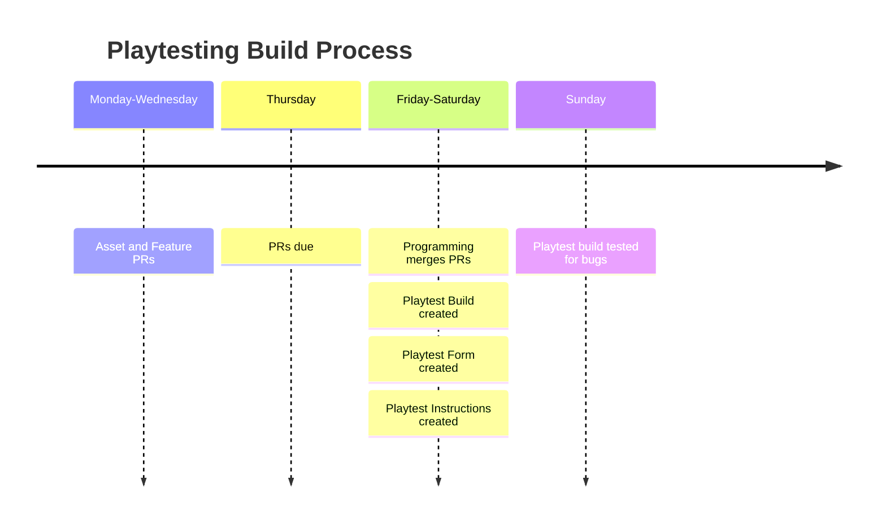

# Playtest Pipeline

## Building Playtests

Playtests should be run at least once a week.

### The Rough Calendar

1. Assets due Thursday evening through a pull request (or earlier if possible) 
	a. Playtesting form creation starts, due Sunday evening.
	b. Playtesting document creation starts, due day before playtest.
2. Playtest builds due by Saturday (or earlier if possible)
	a. Internal testing of the builds done on Sunday, or up until the day before a playtest
3. Playtesting happens any day Monday-Friday

### Playtesting Content
Any new content for the playtest should be made into a pull request for the master branch. Pull requests for next week’s playtest are due Thursday morning, any pull requests opened after will have to wait until next week.

Notes:
- Prior to making a pull request [making a pull request](https://docs.github.com/en/pull-requests/collaborating-with-pull-requests/proposing-changes-to-your-work-with-pull-requests/creating-a-pull-request#creating-the-pull-request) to Main, Merge Main into your branch & resolve merge conflicts (let programming know if there are any) Test after merging to make sure everything works, [Tutorial(Steps 1-3)](https://docs.github.com/en/desktop/working-with-your-remote-repository-on-github-or-github-enterprise/syncing-your-branch-in-github-desktop#merging-another-branch-into-your-project-branch)
- To replace a file: do it through file explorer, not unity’s asset editor.

### Playtesting Form and Document
While programmers are implementing assets and designer requests, designers and anyone else with changes to test should take the time to identify the goals of playtesting.

Designers should make a form to clarify those goals, anyone with specific questions should let designers know what to add to the form. Playtesting form is due Sunday evening.

Writers should create a document to outline controls or context for anything that isn’t present in the game that the player needs to know. This should be printed out or written down the day before the playtest.

### Creating the Builds
Programming will implement any assets or changes delivered over Thursday, with builds due by Saturday, or earlier if possible. Any additional pull requests should be ignored, but any small tweaks that are feasible will be considered.

Builds should have a tag with the name of the relevant playtest that will be used. So we can refer back to certain builds later.

Automatic builds will be done for Windows, there will be no guarantee for other operating systems unless someone else needs a build for their OS.

### Internal Testing
Internal testing happens over the weekend, whenever a playtesting build is finished. Any feedback should be submitted before Sunday evening so that programming can implement changes. A playtest build is finalized by Sunday evening.

## Running Playtests
### Playtest Coordinator
Whoever is running the playtest for MFPR should be decided about a day in advance. They should have a **windows** laptop or desktop with the [latest build](https://puddleduckproductions.github.io/MysticForestParkRanger/docs/github-actions.html) running and working.

### Playtest Form and Document
The playtest form should always be open on the coordinator’s computer, as well as a physical playtesting document (if created) for the player to read at any time.

### Playtest Guidelines
We want to avoid interfering with the player’s experience as much as possible, and so here are the rules for coordinating a playtest:

1. Always take notes
	a. Anything the player says, write it down
	b. If you notice anything yourself, write it down.
	c. Notes should be shared in Discord when the playtest is concluded.
2. No talking to the player during the playtest.
	a. You should ask for their train of thought/stream of consciousness if they are being quiet, but that’s it.
	b. You can talk to them before and after, but you should aim to only cover what the playtesting document covers and the questions the form asks.
	c. Avoid making excuses for the game’s content.
		i. No “oh, yeah this hasn’t been fixed yet”, or “this WILL look like something else”
3. Only help if the player asks for help after about 5 minutes of them being stuck.